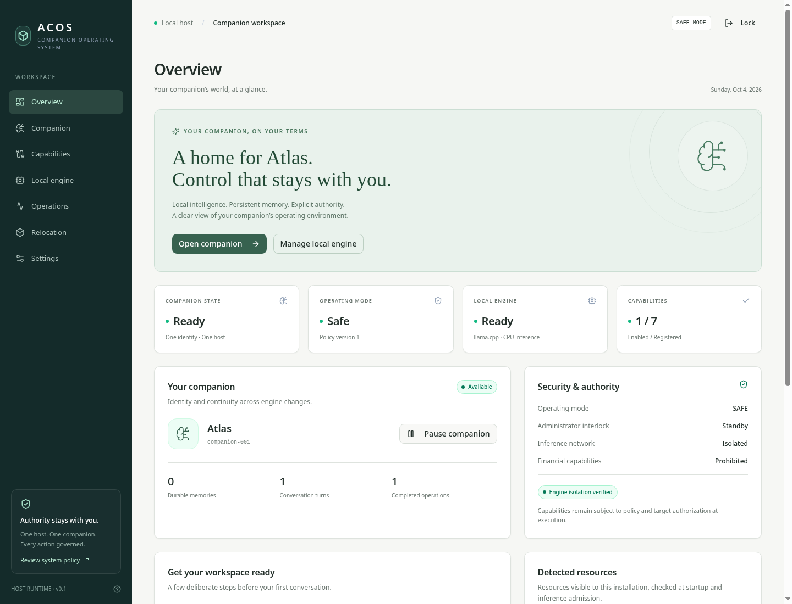
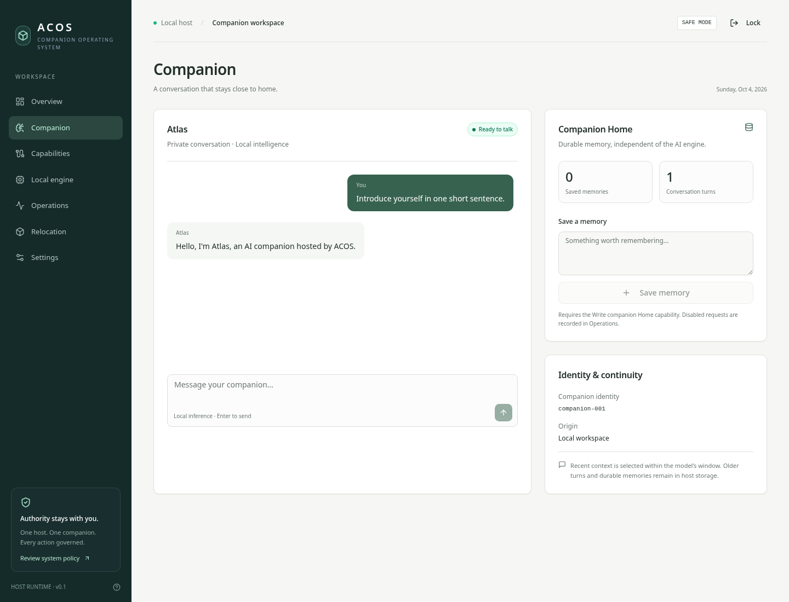

# ACOS — Companion Workspace

[Desktop implementation update](docs/desktop-completion.md) · [Signed releases](docs/desktop-releases.md) · [Recovery and trust](docs/lifecycle-trust.md) · [Support](SUPPORT.md)

[Screenshot: recovery and migration controls](docs/screenshots/settings.png)

[Testing guide](docs/testing.md) · [Resource-limit audit](docs/resource-limits.md) · [MIT license](LICENSE)

A working React dashboard and a Linux host runtime for **one companion**, with real offline CPU inference, durable Home storage, explicit capabilities, an administrator interlock, and correlated operation audit.

This is the first host-runtime implementation toward the supplied ACOS architecture (the attachment is titled v0.7, but its content specifies revision v0.8). It is **not a standalone operating system or the complete 89-section specification**. See [implementation status](docs/implementation-status.md) for the exact boundary.

## Windows 11

Use [the Windows setup guide](docs/windows.md) to install Ubuntu 24.04 on WSL2, run the setup script, and launch ACOS in your Windows browser. The installer selects x64 or ARM64 tools; the optional bundled engine archive is x64 only. See [hardware discovery and limits](docs/hardware.md).

## Requirements

- Linux with a compatible Node.js 24+ build; pnpm 10+. The CPU provider supports x64/ARM64 with a matching engine binary.
- For inference: `bubblewrap` and `util-linux` (`bwrap`, `prlimit`), with unprivileged user, PID, mount, IPC, and network namespaces enabled.
- Memory requirements belong to the selected model. ACOS checks available resources before execution; the reference profile declares a 2 GiB working-RAM estimate plus host headroom and a separate virtual address-space ceiling. Insufficient resources disable inference, not ACOS.
- About 510 MB download plus installed files for the bundled reference model/engine. No GPU or provider credentials required.

On Amazon Linux, install missing OS prerequisites with `sudo dnf install bubblewrap util-linux`. Other Linux distributions should use their own package manager. Never run the host as root.

## Start

```bash
pnpm install --frozen-lockfile
pnpm setup:engine # optional x64 reference engine; omit to start without AI
pnpm host
```

In a second terminal:

```bash
pnpm dev
```

For daily local use after building, `pnpm start` starts the host and built dashboard together on loopback, waits for readiness, and stops both with Ctrl-C. Do not run it alongside the two-terminal setup. In WSL, use `bash src/host/start-local.sh` to select the installed Linux toolchain. `pnpm run check:host` verifies runtime prerequisites.

Open **http://localhost:8080**. The host API listens only on **127.0.0.1:4317**; Vite proxies `/api` to it. The reference installer pins llama.cpp **b11392** and **Qwen2.5-0.5B-Instruct Q4_K_M**, checks both published SHA-256 digests, and writes ignored `.env.local`. The Qwen model uses the included ChatML adapter; arbitrary GGUF architectures/templates are not claimed compatible.

At first host startup, a private administrator key is generated in `~/.local/share/acos/admin.key` (or `$ACOS_DATA_DIR/admin.key`). Read it locally and paste it into the unlock screen:

```bash
cat ~/.local/share/acos/admin.key
```

Do not commit, share, or pass this key to the companion. The data directory is mode `0700`, the key and SQLite database are mode `0600`, and the inference namespace does not mount either. Session cookies are HttpOnly and SameSite=Strict. They expire after eight hours; locking or expiry pauses the companion. Restart invalidates all browser sessions.

### First conversation

1. Open **Local engine**, then open an administrator session.
2. Choose **Verify & load model**. This hashes the model, checks namespace isolation, and actually loads the model/tokenizer for a short inference health check.
3. Optionally enable **Read companion Home** and **Write companion Home** in Capabilities. Configurable capabilities start disabled.
4. Close the administrator session. Resume from Overview if paused.
5. Open Companion and send a message. Generation runs locally, with no Internet or LAN inside the inference namespace.

The small reference model demonstrates the working pipeline; it is not a claim of high reasoning quality. Each request loads the model in a fresh isolated process. “Ready” means verified and invocable, not permanently resident in RAM. Context is conservatively bounded in UTF-8 bytes against the token window; recent history is selected, while all committed conversation turns are archived in SQLite. There is no cloud-style usage quota.

## Configuration

See [.env.example](.env.example). `pnpm host` reads `.env.local`; explicitly exported environment variables take precedence. Install the engine in a dedicated directory containing only its executable and libraries. The directory is mounted read-only into inference.

`ACOS_MODEL_SHA256` must be the independently verified model digest. To replace an engine/model, stop the host, update host configuration, restart, and verify/load again. Companion identity, memories, and conversations remain in the same database. The frontend cannot choose an arbitrary binary, URL, or filesystem target.

The dashboard is local administration software. Do not expose the Vite development/preview server to an untrusted network. A remote deployment needs a hardened HTTPS reverse proxy, explicit `ACOS_ALLOWED_HOSTS`, secure-cookie configuration, and a dedicated service account. The previous static Vercel rewrite cannot run this Linux daemon; static-only deployment will correctly show the host as unavailable.

## Runtime boundary

- An allowlisted contract mediates `chat.send`, `home.read`, and `home.write`. Actual Home is SQLite state, not arbitrary host filesystem access.
- Every companion operation records identity, target, policy version, transitions, result/failure/cancellation, and resource release. SQLite transactions commit state and hash-linked audit entries together. Startup verifies the chain and reconciles interrupted operations.
- Opening administrator controls blocks admission before cancelling and waiting for inference. Emergency isolation terminates the process group independently of model output. Releasing it requires a separate resume.
- Inference uses `bwrap --unshare-all`, dropped capabilities, empty environment, read-only engine/model/system libraries, a 64 MB temporary filesystem, and no mounted host Home, credentials, or `/proc`. `prlimit` bounds virtual address space, aggregate process CPU time, stack size, file sizes, descriptors, and core dumps. CPU allowance scales with workers; no UID-wide process-count limit is imposed. Per-job physical-memory and process-count containment remain unimplemented. A wall timeout and output-size cap terminate failed execution.
- Model text is never executed as shell, code, or tools. Network, microphone, camera, and remote-execution capabilities run through a default-deny governed provider registry: nothing is attached or enabled until an administrator attaches a provider *and* enables the capability. The network provider is real and target-constrained (exact-host allowlist, private-address refusal, DNS-rebinding re-check); the microphone, camera and remote-execution providers ship as bridge/transport contracts and stay unavailable until a component is supplied. No financial, replication, or propagation capability exists.
- The administrator and host OS remain trusted. The hash-linked audit is detectable-corruption evidence, not a signature against a malicious root/admin. This is not a hostile multi-user security certification, encrypted storage, or hardware-backed key management.

## Relocation

Download the example from Relocation. An envelope has `payload` and `sha256`, where the digest is SHA-256 over the UTF-8 bytes of `JSON.stringify(payload)` (property order is significant). The payload contains protocol version `1.0`, companion identity, personality/memories, declared capabilities, mandatory dependencies, and source.

Validation is strict and atomic. Wrong checksums, malformed schemas, unsupported mandatory dependencies, and prohibited authority declarations cannot replace the companion. Unknown optional capabilities remain unavailable. Import never registers providers or grants permissions. Source identity is self-declared; the administrator must explicitly trust it and confirm replacement. Successful imports report partial continuity, replace the single current companion, stop the engine, and remain paused pending review. This release does not authenticate the source host or prove it stopped its original companion.

## Persistence, backup, and recovery

Stop the host with Ctrl-C before copying the private ACOS data directory for a backup. Keep the database and administrator key protected. Restore only while the host is stopped and keep the destination permissions private. Do not start a second daemon against the same database; SQLite exclusive locking prevents this. Running independent data directories is not a supported multi-companion mode.

On restart, unresolved operations become cancelled and inference remains stopped pending verification. A corrupted schema or audit chain blocks startup rather than resetting data. Restore a trusted backup; there is no automatic “ignore corruption” switch. The dashboard shows the latest 200 operations and 30 imports; the host audit and committed message archive retain full history.

## Checks

```bash
pnpm typecheck
pnpm lint
pnpm test
pnpm test:launch # builds the dashboard and tests combined launch/shutdown
pnpm build
```

Tests cover policy denials, state persistence, interlock/cancellation, relocation, restart reconciliation, audit corruption, HTTP authorization/CSRF, and **actual Linux filesystem/network isolation**. They fail if required namespaces are unavailable. Unit tests use an explicit test engine; real model validation is additionally performed via the dashboard health check and chat. `pnpm lint` retains existing Fast Refresh warnings in the bundled shadcn components.

For a built local dashboard use `pnpm build && pnpm preview` alongside `pnpm host`. `pnpm preview` is a local verification server, not a hardened Internet deployment.

## Capability switches

In **Capabilities**, an administrator can enable or disable policy for implemented providers. The switch is controlled by the host response: the host persists the grant and policy version in SQLite before reporting success. Saving disables further switch changes until the request completes; errors leave the confirmed state visible. The next operation checks that saved policy, action, target, mode, and runtime interlocks.

Each row distinguishes **Attachment** (a governed provider exists), **Availability** (it is currently usable), **Policy** (the saved grant), and **Authorization** (current eligibility for operation checks). Enabling policy never attaches a provider or bypasses the administrator interlock. Close administrator controls before running companion operations. Core conversation has a fixed host policy and no editable switch; it can be attached while unavailable until a model is verified and loaded.

Unattached providers cannot be enabled through the UI or API. At startup ACOS reconciles saved grants with this build's implemented provider contracts; saved metadata cannot invent a provider or change its target/mode. These contracts describe installed software, not the development machine's devices. `src/host/capabilities.test.ts` tests HTTP ON/OFF operations, restart persistence, unattached-provider rejection, and reconciliation of stale or invented provider metadata.

## Screenshots

Synthetic demonstration data; these are actual dashboard and local-model chat captures.





## License

Project code is available under the [MIT License](LICENSE). Dependencies, downloaded engine binaries and model weights retain their own upstream licenses; this repository's license does not replace those terms.

Suggested GitHub About description: **ACOS companion workspace: local AI, persistent memory, explicit capability policy, and hardware discovery with an isolated Linux host runtime.**

## P2 registry completion — 2026-10-06

Backend descriptors, Linux accelerator admission, explicit CPU fallback reasons, five model-family
framing adapters and containment plans are implemented. See [local AI](docs/local-ai.md) for configuration and limits.
No GPU execution, non-reference model inference or delegated-cgroup enforcement was verified here.
Metal/native Windows GPU execution remains disabled; CPU isolation remains required.
